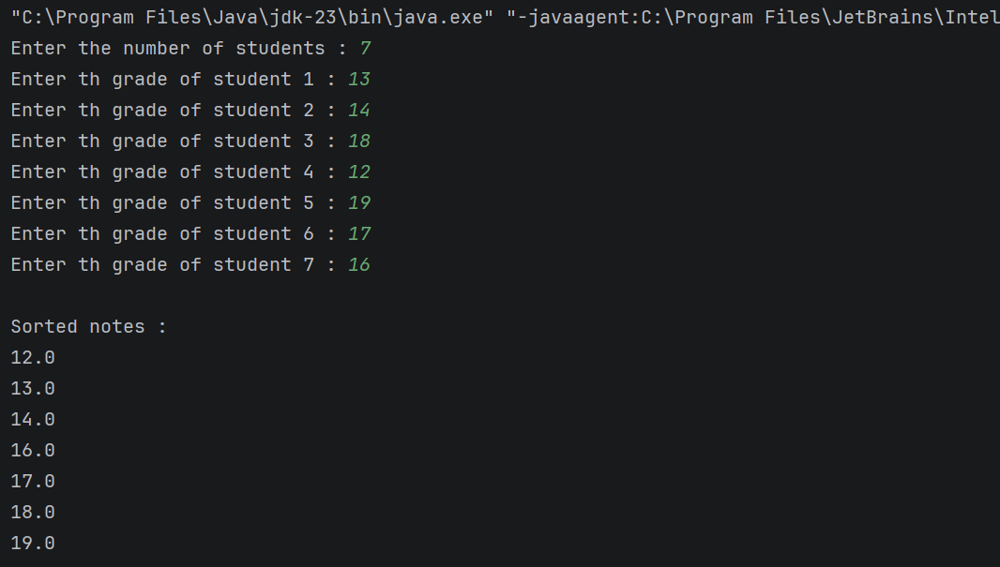
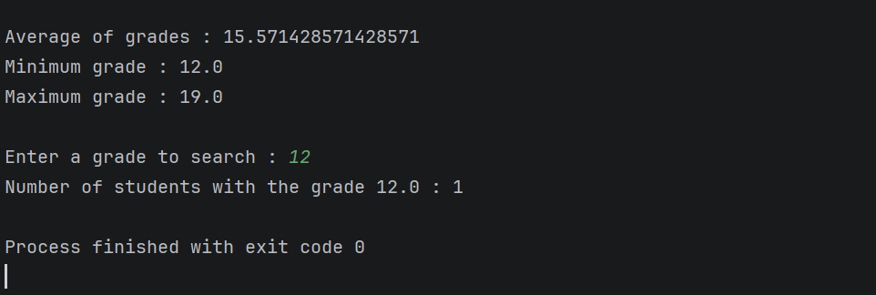
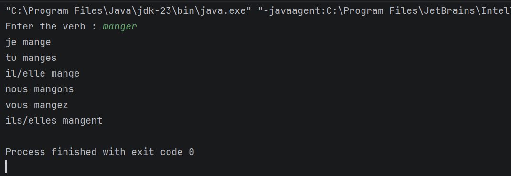
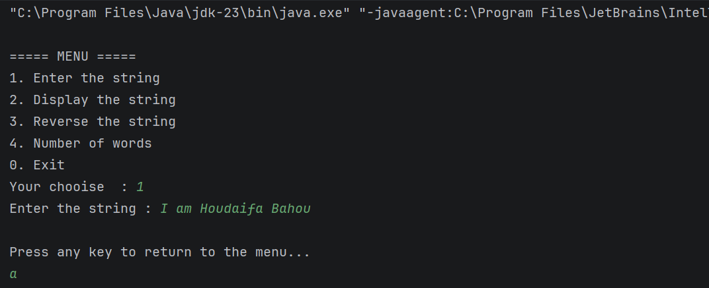
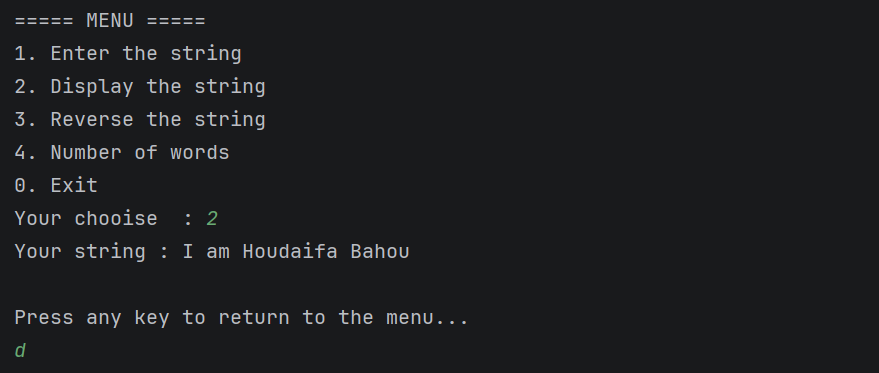
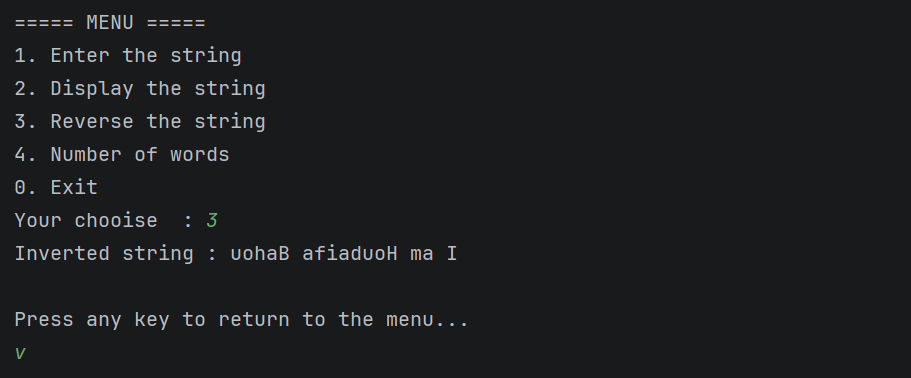
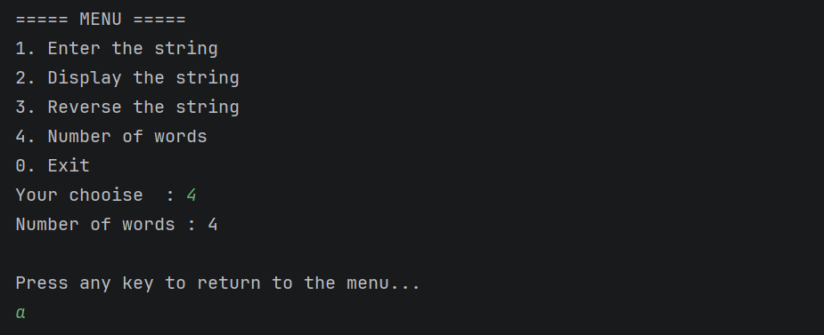
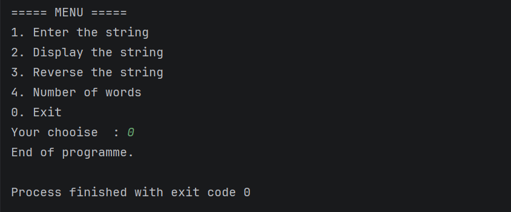
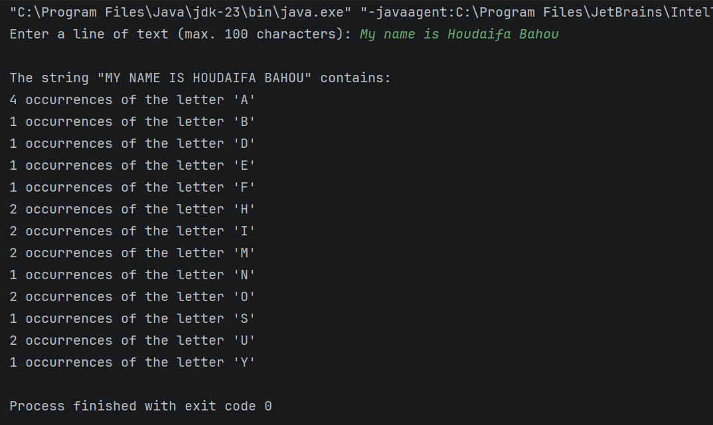

# 📘 Strings and Arrays in Java – Practical Work (TP)

---
### 👤 By: Houdaifa Bahou

---

# 🧪 Exercise 1: Student Grades Management

## 🎯 Objective
The objective of this exercise is to develop a Java program that stores student grades in an array and performs several operations on them.

---

## 📝 Description
The program reads grades entered via the keyboard and allows the following operations:
- Sorting and displaying the grades
- Calculating the average grade
- Displaying the highest and lowest grades
- Counting the number of students who obtained a specific grade

---

## ⚙️ Features
- Use of arrays
- Sorting using `Arrays.sort()`
- Loops and conditional statements
- Keyboard input with `Scanner`

---

## 🖼️ Program Execution Screenshot

---

# 🧪 Exercise 2: Conjugation of First Group Verbs

## 🎯 Objective
The goal of this exercise is to create a Java program that conjugates a regular French verb of the first group in the present tense.

---

## 📝 Description
The program:
- Reads a verb from the keyboard
- Checks if the verb ends with `"er"`
- Assumes the verb is regular
- Displays the conjugation for all personal pronouns

---

## ⚙️ Features
- String manipulation
- Use of `endsWith()` and `substring()`
- Conditional structures

---

## 🖼️ Program Execution Screenshot

---

# 🧪 Exercise 3: Operations on a Character String (Menu-Based Program)

## 🎯 Objective
The objective of this exercise is to manipulate a string using a menu-driven Java program.

---

## 📝 Description
The program displays a menu that allows the user to:
1. Enter a string
2. Display the string
3. Reverse the string
4. Count the number of words in the string

After each operation, the program returns to the menu.

---

## ⚙️ Features
- Menu-based program using `do-while`
- String processing
- Handling multiple consecutive spaces
- Use of methods

---

## 🖼️ Program Execution Screenshot

---

# 🧪 Exercise 4: Letter Occurrence Counting Using ASCII Codes

## 🎯 Objective
The objective of this exercise is to count the occurrences of alphabet letters in a string without distinguishing between uppercase and lowercase letters.

---

## 📝 Description
The program:
- Reads a string from the keyboard
- Converts characters to uppercase
- Uses a 26-element array to store letter occurrences
- Uses ASCII codes to calculate array indices
- Displays only letters that appear at least once

---

## ⚙️ Features
- ASCII code manipulation
- Character processing
- One-dimensional array of size 26
- Conditional output filtering

---

## 🖼️ Program Execution Screenshot

---

## ✅ Conclusion
This practical work helped reinforce fundamental Java programming concepts such as:
- Arrays
- Loops
- String manipulation
- ASCII codes
- Menu-driven programs

It also improved problem-solving skills and understanding of structured programming in Java.

---